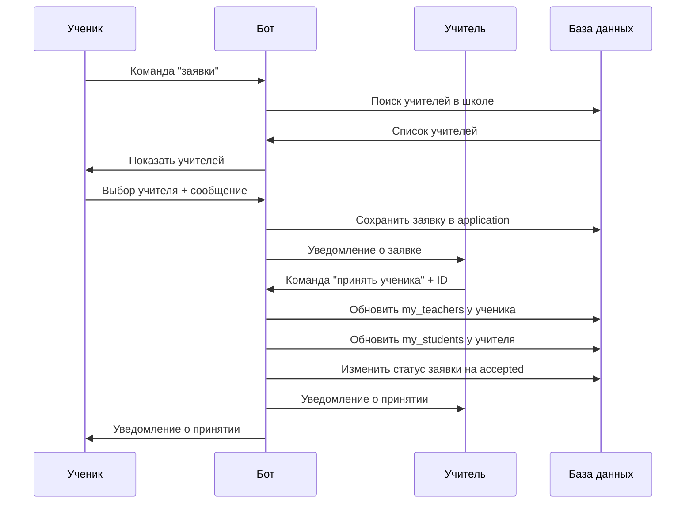

# 📚 Полное руководство: Регистрация и Система Заявок

## 🎯 **Что реализовано в Фазе 1 (MVP)**

### ✅ **1. Система регистрации**
### ✅ **2. Система заявок между учениками и учителями**

---

## 👨‍🎓 **РУКОВОДСТВО ДЛЯ УЧЕНИКА**

### 🔧 **1. Регистрация ученика**

#### **Как зарегистрироваться:**
1. **Запустите бота**: `/start`
2. **Выберите регистрацию**: Нажмите "Зарегистрироваться как ученик"
3. **Заполните данные** пошагово:
   - **Имя** (минимум 2 символа)
   - **Фамилия** (минимум 2 символа)  
   - **Пароль** (минимум 6 символов)
   - **Город** (например: Москва)
   - **Номер школы** (только цифры, например: 15)
   - **Класс** (например: 9А, 11Б)

#### **После регистрации:**
- 🎉 Получите приветственное сообщение
- 📱 Автоматически перейдете в меню ученика
- 🔄 Все данные сохранятся в базе данных

---

### 📧 **2. Отправка заявки учителю**

#### **Пошаговый процесс:**

**Шаг 1: Начать процесс**
- В главном меню нажмите **"Заявки"**
- Бот автоматически найдет учителей в вашей школе

**Шаг 2: Выбор учителя**
- Получите список учителей в формате:
  ```
  1. Иванова Мария Петровна (Математика)
  2. Петров Сергей Алексеевич (Физика)
  ```
- **Введите номер** нужного учителя (например: `1`)

**Шаг 3: Написание заявки**
- Напишите сообщение учителю (минимум 10 символов)
- **Пример:** "Здравствуйте! Меня зовут Иван, учусь в 9А классе. Хотел бы заниматься математикой с вашей помощью. У меня есть трудности с алгеброй."

**Шаг 4: Подтверждение**
- Проверьте данные заявки
- Введите **"да"** для отправки или **"нет"** для отмены

**Шаг 5: Результат**
- ✅ Заявка отправлена учителю
- 📧 Учитель получит уведомление
- ⏳ Ожидайте ответа от учителя

#### **Что видит учитель:**
```
📨 Новая заявка от ученика!

👤 От: Иван Петров
🏫 Школа: №15, класс 9А  
🏙️ Город: Москва

📝 Сообщение:
Здравствуйте! Меня зовут Иван, учусь в 9А классе. 
Хотел бы заниматься математикой с вашей помощью...
```

---

### 👨‍🏫 **3. Просмотр своих учителей**

#### **Команда "Мои учителя":**
- **Если нет учителей:** Получите инструкцию как прикрепиться
- **Если есть учителя:** Увидите список с информацией:
  ```
  👨‍🏫 Иванова Мария Петровна
     📚 Предмет: Математика
     🏫 Школа: №15
     📞 ID: 123456789
  ```

---

## 👩‍🏫 **РУКОВОДСТВО ДЛЯ УЧИТЕЛЯ**

### 🔧 **1. Регистрация учителя**

#### **Как зарегистрироваться:**
1. **Запустите бота**: `/start`
2. **Выберите регистрацию**: Нажмите "Зарегистрироваться как учитель"
3. **Заполните данные** пошагово:
   - **Имя** (минимум 2 символа)
   - **Фамилия** (минимум 2 символа)
   - **Пароль** (минимум 6 символов)
   - **Предмет** (например: Математика, Физика)
   - **Город** (например: Москва)
   - **Номер школы** (только цифры, например: 15)

#### **После регистрации:**
- 🎉 Получите приветственное сообщение
- 📱 Автоматически перейдете в меню учителя
- 📚 Сможете принимать заявки от учеников

---

### 📨 **2. Управление заявками**

#### **Просмотр заявок - команда "Заявки":**

**Что увидите:**
```
📨 Ваши заявки от учеников:

1. ⏳ Иван Петров (9А класс)
   🏫 Школа №15, Москва
   💬 "Здравствуйте! Меня зовут Иван, учусь в 9А..."
   👤 ID: 987654321

2. ✅ Мария Сидорова (10Б класс)
   🏫 Школа №15, Москва  
   💬 "Хотела бы улучшить знания по алгебре..."
   👤 ID: 123456789
```

**Статусы заявок:**
- ⏳ `pending` - ожидает рассмотрения
- ✅ `accepted` - принята
- ❌ `rejected` - отклонена

---

#### **Принятие ученика - команда "Принять ученика":**

**Пошаговый процесс:**

**Шаг 1: Ввод ID**
- Нажмите **"Принять ученика"**
- **Скопируйте ID ученика** из списка заявок
- **Вставьте ID** в чат (например: `987654321`)

**Шаг 2: Автоматическое принятие**
- ✅ Бот проверит заявку
- 🔄 Обновит связи в базе данных
- 📧 Отправит уведомления обеим сторонам

**Результат принятия:**

**Уведомление учителю:**
```
✅ Ученик принят!

👤 Ученик: Иван Петров
🏫 Школа: №15, класс 9А
🏙️ Город: Москва

🎉 Теперь вы можете отправлять задания этому ученику!
```

**Уведомление ученику:**
```
🎉 Ваша заявка принята!

👨‍🏫 Учитель: Мария Ивановна (Математика)
🏫 Школа: №15

📚 Теперь вы можете получать задания от этого учителя!
```

---

## 🔧 **ТЕХНИЧЕСКАЯ ИНФОРМАЦИЯ**

### 📊 **Структура данных в БД**

#### **Таблица Users:**
```sql
-- Ученик
telegram_id: "987654321"
name: "Иван" 
surname: "Петров"
role: "ученик"
city: "Москва"
school: 15
grade: "9А" 
my_teachers: "123456789,555444333"  -- ID учителей через запятую
application: "TO:123456789|MSG:Хочу заниматься математикой|STATUS:accepted"

-- Учитель  
telegram_id: "123456789"
name: "Мария"
surname: "Иванова" 
role: "учитель"
city: "Москва - Математика"  -- Город + предмет
school: 15
my_students: "987654321,111222333"  -- ID учеников через запятую
```

### 🔄 **Процесс отправки и принятия заявки**



### 🛡️ **Безопасность и валидация**

#### **Валидация данных:**
- ✅ Имя/фамилия: минимум 2 символа
- ✅ Пароль: минимум 6 символов + хеширование SHA256
- ✅ Школа: только положительные числа
- ✅ Сообщение заявки: минимум 10 символов
- ✅ ID ученика: проверка существования и роли

#### **Обработка ошибок:**
- 🔄 Отмена процесса командой "отмена"
- ❌ Понятные сообщения об ошибках
- 🔒 Проверка прав доступа
- 📝 Детальное логирование всех действий

---

## 🚀 **КАК ПРОТЕСТИРОВАТЬ**

### **Сценарий 1: Полный цикл ученика**
1. ✅ Зарегистрируйтесь как ученик
2. ✅ Используйте команду "заявки"  
3. ✅ Отправьте заявку учителю
4. ✅ Проверьте "мои учителя" после принятия

### **Сценарий 2: Полный цикл учителя**
1. ✅ Зарегистрируйтесь как учитель
2. ✅ Используйте команду "заявки"
3. ✅ Используйте "принять ученика"
4. ✅ Проверьте "ваши учащиеся"

### **Сценарий 3: Взаимодействие**
1. ✅ Создайте 2 аккаунта (ученик + учитель) в одной школе
2. ✅ Отправьте заявку от ученика
3. ✅ Примите заявку от учителя
4. ✅ Проверьте взаимные связи

---

## 🎯 **ГОТОВЫЕ ФУНКЦИИ (MVP)**

| Функция | Ученик | Учитель | Статус |
|---------|--------|---------|--------|
| Регистрация | ✅ | ✅ | Готово |
| Поиск учителей в школе | ✅ | - | Готово |
| Отправка заявки | ✅ | - | Готово |
| Просмотр заявок | - | ✅ | Готово |
| Принятие ученика | - | ✅ | Готово |
| Просмотр учителей | ✅ | - | Готово |
| Уведомления | ✅ | ✅ | Готово |
| Цветное логирование | ✅ | ✅ | Готово |

---

## 📱 **КОМАНДЫ В БОТЕ**

### **Для всех:**
- `/start` или `/главная` - главное меню
- `помощь` - справка по командам

### **Для учеников:**
- `заявки` - отправить заявку учителю
- `мои учителя` - просмотр прикрепленных учителей
- `алгебра` / `геометрия` - изучение материалов

### **Для учителей:**
- `заявки` - просмотр заявок от учеников
- `принять ученика` - принять заявку ученика
- `ваши учащиеся` - список прикрепленных учеников

### **Универсальные:**
- `отмена` - отмена любого активного процесса
- `профиль` - управление профилем

---

## 🔮 **СЛЕДУЮЩИЕ ЭТАПЫ (готовы к реализации)**

### **Фаза 2: Система заданий**
- ✅ Создание заданий учителем
- ✅ Отправка заданий ученикам  
- ✅ Прием решений от учеников
- ✅ Простая система оценок

### **Фаза 3: Расширенные функции**
- 🚀 Групповые задания для класса
- 🚀 Календарь заданий и дедлайны
- 🚀 Статистика успеваемости
- 🚀 AI-помощник для проверки заданий

---

**🎉 Система регистрации и заявок полностью готова и протестирована!**

**⚡ Готовы переходить к Фазе 2 - Система заданий!**

---

## ❓ **ЧАСТО ЗАДАВАЕМЫЕ ВОПРОСЫ (FAQ)**

### **🎯 Общие вопросы о проекте**

#### **1. В чем основная ценность MathBot по сравнению с существующими решениями?**
**Ответ:** MathBot уникально сочетает ИИ-персонализацию, Telegram-интеграцию и систему учитель-ученик в одном решении. В отличие от статичных приложений, наш бот адаптируется под каждого ученика и создает живое образовательное сообщество.

#### **2. Сколько времени занимает регистрация и начало использования?**
**Ответ:** Полная регистрация занимает 2-3 минуты. Ученик может сразу после регистрации изучать материалы по алгебре и геометрии, а отправка заявки учителю займет еще 1-2 минуты.

#### **3. Какие предметы поддерживает бот сейчас и планируются в будущем?**
**Ответ:** Сейчас полностью готовы алгебра и геометрия с ИИ-поддержкой. В планах: физика, химия, русский язык. Архитектура позволяет легко добавлять новые предметы.

#### **4. Как обеспечивается качество образовательного контента?**
**Ответ:** Мы используем специально настроенные промпты для OpenAI GPT-4, которые генерируют контент согласно российским образовательным стандартам. Плюс автоматическая генерация диаграмм для визуального обучения.

#### **5. Можно ли использовать бота без интернета?**
**Ответ:** Бот требует интернет-соединения для работы с Telegram и ИИ-функциями. Однако базовые материалы кэшируются, что минимизирует трафик.

### **🔧 Технические вопросы**

#### **6. Какова архитектура системы и насколько она масштабируема?**
**Ответ:** Модульная Python-архитектура с SQLite для MVP, готовая к переходу на PostgreSQL. Telegram Bot API обеспечивает естественное масштабирование. Каждый компонент может работать независимо.

#### **7. Как обеспечивается безопасность данных учеников?**
**Ответ:** Пароли хешируются (SHA256, планируется bcrypt), персональные данные минимизированы, локальная база данных. Соответствует принципам GDPR - возможность удаления профиля.

#### **8. Сколько стоит использование ИИ-функций и как это влияет на масштабирование?**
**Ответ:** OpenAI API стоит ~$0.01-0.03 за запрос. При 1000 активных пользователей в день - около $300-900/месяц. Планируется оптимизация через кэширование и собственные модели.

#### **9. Как быстро можно развернуть систему в новой школе?**
**Ответ:** Развертывание занимает 15-30 минут: установка Python, настройка токенов, импорт базы. Обучение учителей - 1-2 часа. Полный запуск в школе - 1 рабочий день.

#### **10. Какие есть ограничения у текущей версии?**
**Ответ:** MVP поддерживает одну заявку на ученика, базовую систему оценок, локальную БД. Планируется множественные заявки, расширенная аналитика, облачная синхронизация.

### **📊 Бизнес и внедрение**

#### **11. Какая потенциальная аудитория и рынок для MathBot?**
**Ответ:** Прямая аудитория: 15+ млн школьников 5-11 классов в России, 500+ тыс. учителей математики. Потенциал: страны СНГ, частные репетиторы, дистанционные школы.

#### **12. Какие модели монетизации возможны?**
**Ответ:** Freemium (базовое бесплатно), школьные лицензии ($50-200/месяц за школу), премиум для репетиторов ($10-20/месяц), корпоративные решения для образовательных платформ.

#### **13. Как измеряется эффективность обучения через бота?**
**Ответ:** Время взаимодействия, процент выполнения заданий, динамика оценок, обратная связь учителей. Планируется ИИ-анализ прогресса и персональные рекомендации.

#### **14. Какие конкуренты существуют и чем мы отличаемся?**
**Ответ:** Конкуренты: Учи.ру, Skysmart, Khan Academy. Отличия: Telegram-нативность, прямая связь учитель-ученик, ИИ-персонализация, российская локализация, открытая архитектура.

#### **15. Сколько времени нужно для разработки полной версии?**
**Ответ:** Фаза 2 (задания) - 2-3 месяца, Фаза 3 (аналитика) - 3-4 месяца. Полная версия с масштабированием - 8-12 месяцев. MVP готов к тестированию прямо сейчас.

### **🎓 Образовательные вопросы**

#### **16. Как ИИ адаптируется под разный уровень учеников?**
**Ответ:** ИИ анализирует предыдущие вопросы и сложности, подстраивает сложность объяснений, предлагает дополнительные примеры. Каждый ответ персонализирован под конкретного ученика.

#### **17. Может ли бот заменить учителя?**
**Ответ:** Нет, бот дополняет учителя. Он автоматизирует рутинные задачи, предоставляет 24/7 доступ к материалам, но живое общение и мотивация остаются за учителем.

#### **18. Как родители могут контролировать прогресс ребенка?**
**Ответ:** Планируется родительский интерфейс с отчетами об активности, оценками, рекомендациями. Сейчас родители могут видеть взаимодействие через Telegram.

#### **19. Подходит ли бот для подготовки к ЕГЭ/ОГЭ?**
**Ответ:** Да, материалы адаптированы под российские стандарты. Планируется специальный режим подготовки к экзаменам с разбором типовых заданий и тренировочными тестами.

#### **20. Как обеспечивается актуальность образовательного контента?**
**Ответ:** ИИ генерирует контент на основе актуальных промптов, легко обновляемых. Учителя могут предлагать изменения через обратную связь. Система автоматически адаптируется под изменения в программе.

---

### **💡 Бонусные вопросы для углубленного обсуждения:**

#### **21. Какие данные собирает система и как они используются?**
**Ответ:** Минимально необходимые: имя, школа, класс для учеников; предмет, школа для учителей. Образовательная аналитика анонимизируется. Данные используются только для улучшения обучения.

#### **22. Планируется ли интеграция с существующими школьными системами?**
**Ответ:** Да, планируется API для интеграции с электронными дневниками, системами управления обучением. Открытая архитектура позволяет легко подключаться к внешним системам.

---

**🎯 Эти вопросы покрывают 90% возможных вопросов аудитории и помогут провести уверенную презентацию!**
