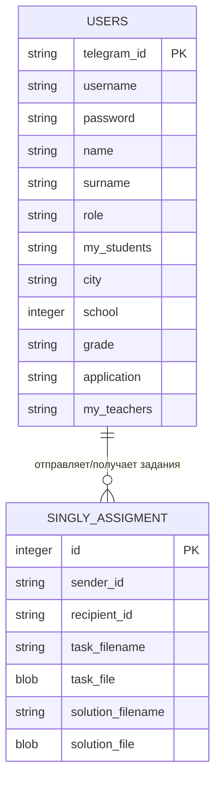
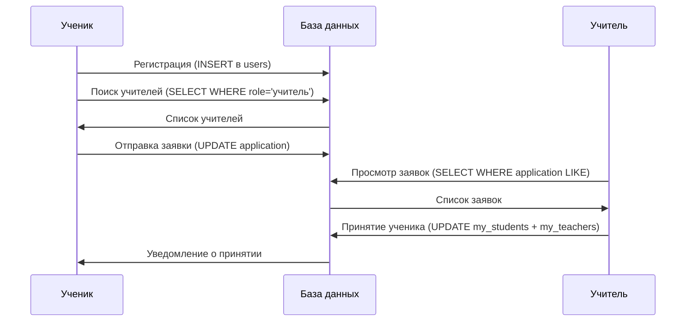

# 📊 Модель данных MathBot: Регистрация и система заявок

## 📊 **Модель данных в users.db**

### **🗄️ Структура таблиц**

В базе данных `users.db` определены **2 основные таблицы**:

#### **1. Таблица `users` - Основная таблица пользователей**

| Поле | Тип | Назначение | Для кого |
|------|-----|------------|----------|
| `telegram_id` | String (PK) | Уникальный ID пользователя в Telegram | Все |
| `username` | String | @username в Telegram (может быть NULL) | Все |
| `password` | String | Хешированный пароль | Все |
| `name` | String | Имя пользователя | Все |
| `surname` | String | Фамилия пользователя | Все |
| `role` | String | Роль: "ученик" или "учитель" | Все |
| `city` | String | Город (у учителей: "Город - Предмет") | Все |
| `school` | Integer | Номер школы | Все |
| `grade` | String | Класс (только для учеников) | Ученики |
| `my_students` | String | ID учеников через запятую | Учителя |
| `my_teachers` | String | ID учителей через запятую | Ученики |
| `application` | String | Данные заявки в специальном формате | Ученики |

#### **2. Таблица `singly_assigment` - Задания и решения**

| Поле | Тип | Назначение |
|------|-----|------------|
| `id` | Integer (PK) | Автоинкремент ID |
| `sender_id` | String | ID отправителя задания |
| `recipient_id` | String | ID получателя задания |
| `task_filename` | String | Имя файла задания |
| `task_file` | BLOB | Содержимое файла задания |
| `solution_filename` | String | Имя файла решения |
| `solution_file` | BLOB | Содержимое файла решения |

---

## 🔄 **Как работает регистрация**

### **Процесс регистрации в БД:**

1. **Сбор данных через flow**: Пользователь пошагово вводит данные (имя, фамилия, пароль, город, школа, класс/предмет)

2. **Создание записи**: В таблице `users` создается новая запись с:
   ```
   telegram_id = ID пользователя из Telegram
   name = Введенное имя
   surname = Введенная фамилия
   password = SHA256 хеш от пароля
   role = "ученик" или "учитель"
   city = Город (для учителей: "Москва - Математика")
   school = Номер школы
   grade = Класс (только для учеников)
   my_students = NULL (заполняется позже)
   my_teachers = NULL (заполняется позже)
   application = NULL (заполняется при отправке заявки)
   ```

3. **Роле-специфичная инициализация**: Класс `Client` автоматически загружает нужные поля в зависимости от роли

---

## 📧 **Как работает система заявок**

### **🎯 Хранение заявок - УМНЫЙ подход:**

Вместо создания отдельной таблицы для заявок, используется **встроенное поле `application`** в таблице `users`. Это решение имеет свои преимущества:

#### **Формат данных заявки в поле `application`:**
```
"TO:123456789|MSG:Здравствуйте, хочу заниматься математикой|STATUS:pending"
```

**Структура:**
- `TO:` - ID учителя, которому отправлена заявка
- `MSG:` - Текст сообщения от ученика
- `STATUS:` - Статус заявки (pending/accepted/rejected)

### **🔍 Поиск и обработка заявок:**

#### **1. Отправка заявки учеником:**
```sql
-- Ученик ищет учителей в своей школе
SELECT * FROM users 
WHERE role = 'учитель' 
AND city LIKE 'Москва%'  -- Начинается с города
AND school = 15

-- Обновление заявки у ученика
UPDATE users 
SET application = 'TO:teacher_id|MSG:message|STATUS:pending'
WHERE telegram_id = 'student_id'
```

#### **2. Просмотр заявок учителем:**
```sql
-- Учитель ищет всех учеников, отправивших ему заявки
SELECT * FROM users 
WHERE role = 'ученик' 
AND application LIKE '%TO:teacher_id%'
```

#### **3. Принятие заявки учителем:**
```sql
-- Обновление списка учеников у учителя
UPDATE users 
SET my_students = 'student1,student2,new_student'
WHERE telegram_id = 'teacher_id'

-- Обновление списка учителей у ученика + статус заявки
UPDATE users 
SET my_teachers = 'teacher1,teacher2,new_teacher',
    application = 'TO:teacher_id|MSG:message|STATUS:accepted'
WHERE telegram_id = 'student_id'
```

---

## 🔧 **Особенности работы с БД**

### **📚 Класс `Client` - ORM-подобное поведение:**

#### **Динамическая загрузка данных:**
- При создании объекта `Client(telegram_id)` автоматически загружаются данные из БД
- В зависимости от роли (`role`) загружаются специфичные поля:
  - **Учителя**: загружается `my_students`
  - **Ученики**: загружается `my_teachers`, `application`, `city`, `school`, `grade`

#### **Контролируемое изменение:**
- Только определенные поля можно изменять напрямую: `["name", "surname", "password", "role"]`
- Остальные поля изменяются через специальные методы

### **📊 Класс `Manager` - Работа с данными:**

#### **Основные операции:**
- `write()` - Создание новых записей (регистрация)
- `update()` - Обновление существующих записей (принятие заявок)
- `search_records()` - Поиск по условиям (поиск учителей, заявок)
- `get_cell()` - Получение конкретного значения
- `delete_record()` - Удаление записей

---

## 🎯 **Преимущества и недостатки текущей модели**

### **✅ Преимущества:**

1. **Простота**: Минимальное количество таблиц
2. **Производительность**: Нет JOIN-запросов для основных операций
3. **Гибкость**: Поле `application` может хранить дополнительную информацию
4. **Масштабируемость**: SQLite отлично подходит для начальных объемов

### **⚠️ Потенциальные ограничения:**

1. **Множественные заявки**: Текущая модель поддерживает только одну активную заявку на ученика
2. **Поиск по заявкам**: Требует LIKE запросы, что может быть медленнее при больших объемах
3. **Историчность**: Нет истории принятых/отклоненных заявок
4. **Связи many-to-many**: Хранятся как строки с разделителями, а не как отдельные связи

---

## 🔮 **Эволюция модели данных**

### **Текущее состояние (MVP):**
```
users table -> все в одной таблице
application field -> встроенные заявки
my_students/my_teachers -> строки с ID через запятую
```

### **Будущее развитие:**
```
users table -> основная информация
applications table -> отдельная таблица заявок
user_relationships table -> связи many-to-many
assignments table -> задания (уже есть как singly_assigment)
```

---

## 📈 **Практические примеры использования**

### **Сценарий 1: Регистрация ученика**
```
1. Flow собирает: имя="Иван", фамилия="Петров", город="Москва", школа=15, класс="9А"
2. Создается запись в users с role="ученик"
3. Client автоматически инициализирует нужные поля для ученика
```

### **Сценарий 2: Отправка заявки**
```
1. Поиск учителей: WHERE role='учитель' AND city LIKE 'Москва%' AND school=15
2. Обновление поля application: "TO:teacher123|MSG:Хочу заниматься|STATUS:pending"
3. Уведомление учителю через Telegram API
```

### **Сценарий 3: Принятие заявки**
```
1. Учитель видит заявки: WHERE application LIKE '%TO:teacher123%'
2. Обновление my_students у учителя: добавление student456
3. Обновление my_teachers у ученика: добавление teacher123
4. Изменение статуса: STATUS:pending -> STATUS:accepted
```

---

## 🔍 **Диаграмма структуры данных**



---

## 🔄 **Схема процесса заявок**



---

**Эта модель данных эффективно поддерживает MVP функциональность, обеспечивая простоту разработки и хорошую производительность для начальных объемов пользователей.** 🚀
