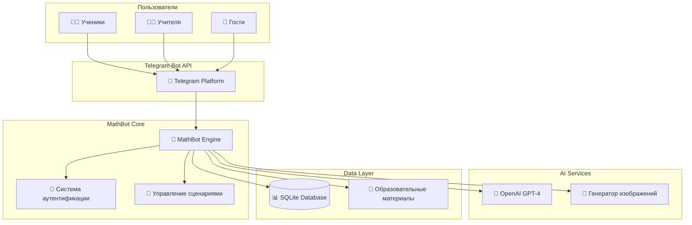
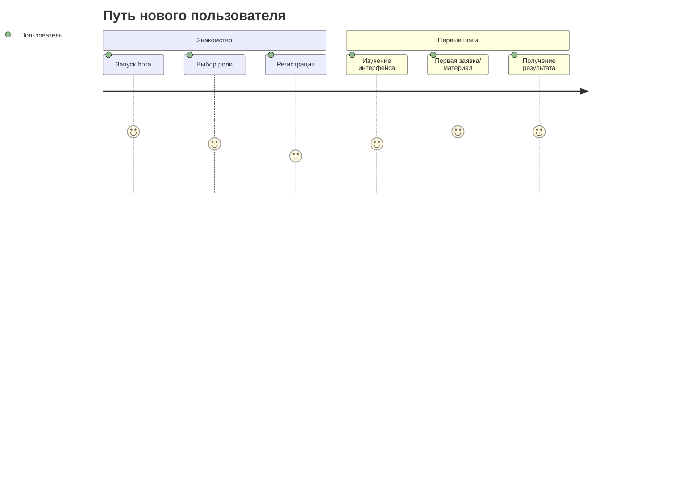
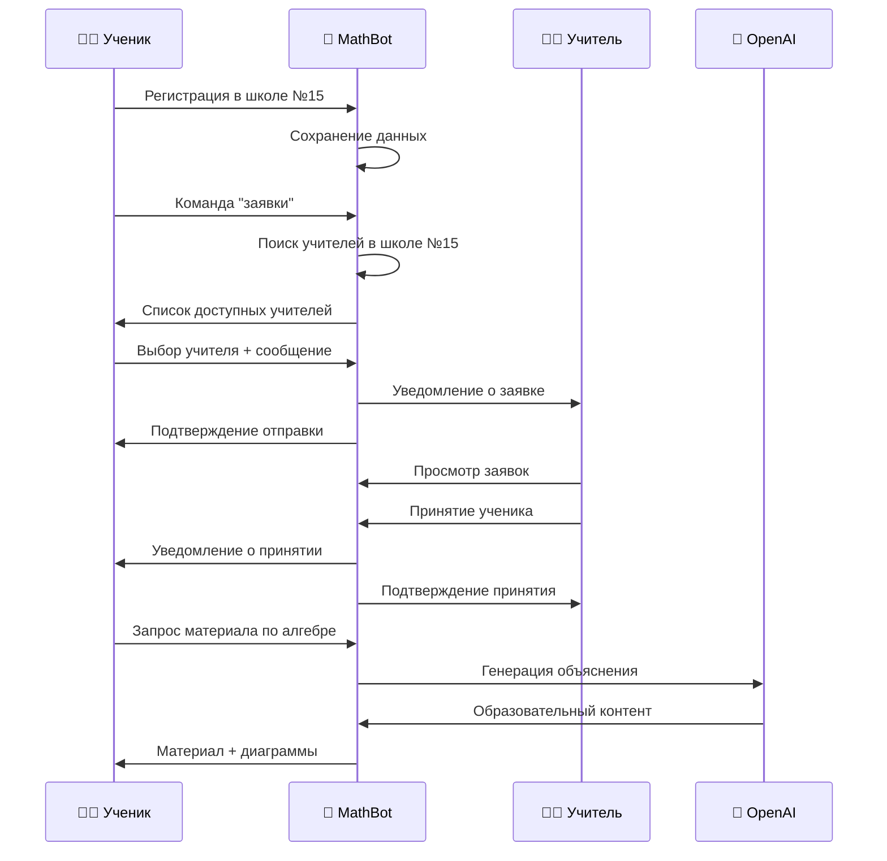
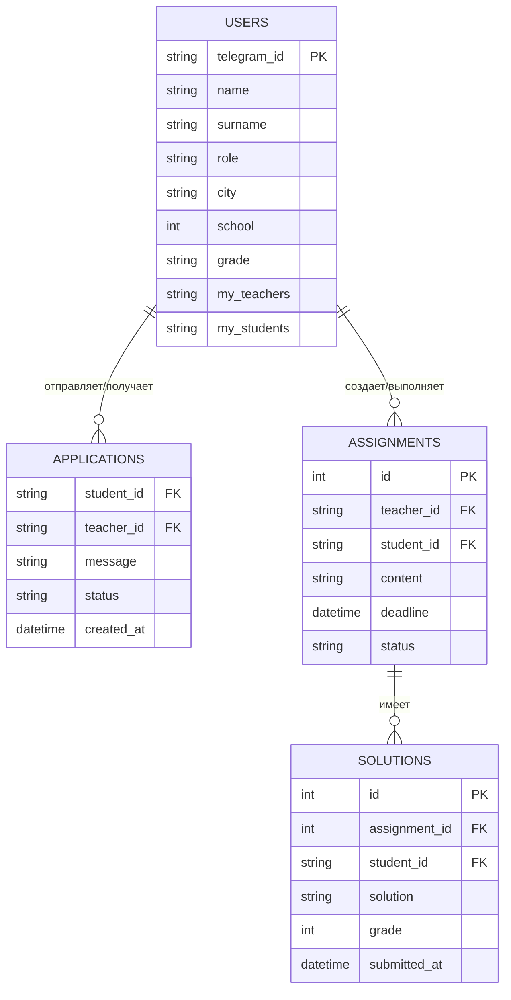

# 🤖 MathBot: Интеллектуальный Телеграм-бот для изучения математики

## 📋 **Обзор проекта**

**MathBot** — это современный Telegram-бот, разработанный для революционного подхода к изучению математики. Бот сочетает в себе искусственный интеллект, интерактивное обучение и систему взаимодействия между учениками и учителями.

### 🎯 **Миссия проекта**
Сделать изучение математики доступным, интерактивным и персонализированным для каждого ученика, предоставив учителям мощные инструменты для эффективного преподавания.

---

## 🏗️ **Архитектура системы**

### **Общая схема архитектуры**



### **Модульная структура**

| Модуль | Назначение | Ключевые функции |
|--------|------------|------------------|
| **Main** | Основной обработчик | Маршрутизация команд, логирование |
| **Theory** | Образовательный контент | AI-материалы по алгебре и геометрии |
| **Database** | Управление данными | Пользователи, заявки, задания |
| **LLM** | ИИ-интеграция | OpenAI API, обработка запросов |
| **Keyboards** | Интерфейс | Динамические клавиатуры |
| **Image Generator** | Визуализация | Математические диаграммы и графики |

---

## 👥 **Пользовательские роли и возможности**

### **🎓 Ученики**

#### **Основные возможности:**
- 📚 **Изучение материалов** по алгебре и геометрии с ИИ-поддержкой
- 🔍 **Поиск учителей** в своей школе и городе
- 📝 **Отправка заявок** на прикрепление к учителю
- 📊 **Просмотр своих учителей** и статуса заявок
- 🤖 **ИИ-ассистент** для объяснения тем и решения задач
- 📐 **Интерактивные диаграммы** и графики

#### **Образовательные разделы:**
- **Алгебра:** Уравнения, неравенства, функции, тригонометрия
- **Геометрия:** Треугольники, четырехугольники, окружности, объемы

### **👩‍🏫 Учителя**

#### **Основные возможности:**
- 📨 **Управление заявками** от учеников
- 👥 **Принятие учеников** и формирование классов
- 📋 **Просмотр списка учащихся**
- 📚 **Создание и отправка заданий** (в разработке)
- ✅ **Проверка решений** учеников (в разработке)
- 📊 **Аналитика успеваемости** (планируется)

### **👤 Гости (незарегистрированные пользователи)**

#### **Доступные функции:**
- 📖 **Просмотр базовых материалов** по математике
- 📝 **Регистрация** как ученик или учитель
- ❓ **Справочная информация** о боте

---

## 🔄 **Пользовательские сценарии (User Journey)**

### **Сценарий 1: Регистрация и первое использование**



### **Сценарий 2: Взаимодействие Ученик-Учитель**



---

## 🧠 **Искусственный интеллект и автоматизация**

### **ИИ-возможности бота:**

#### **📚 Образовательный ИИ:**
- **Персонализированные объяснения** математических концепций
- **Адаптивный контент** в зависимости от уровня ученика
- **Интерактивные примеры** и пошаговые решения
- **Мультимодальный подход**: текст + визуализация

#### **🎨 Генерация изображений:**
- **Математические графики**: функции, параболы, гиперболы
- **Геометрические фигуры**: треугольники, четырехугольники, окружности
- **Тригонометрические диаграммы**: единичная окружность, функции
- **Формулы площадей и объемов** с визуальными примерами

#### **🔧 Технические особенности ИИ:**
- **Модель**: OpenAI GPT-4o/GPT-4o-mini
- **Контекст**: Специализированные промпты для математического образования
- **Языковая поддержка**: Полностью на русском языке
- **Форматирование**: Markdown с автоматической очисткой LaTeX

### **Примеры ИИ-взаимодействия:**

#### **Запрос ученика:** "Объясни квадратные уравнения"

**Ответ ИИ:**
```
📐 Квадратные уравнения

**Что это такое?**
Квадратное уравнение — это уравнение вида ax² + bx + c = 0, 
где a ≠ 0.

**Как решать:**
1. **Дискриминант**: D = b² - 4ac
2. **Если D > 0**: два корня
3. **Если D = 0**: один корень  
4. **Если D < 0**: нет решений

[Автоматически генерируется график параболы]
```

---

## 💾 **Управление данными и безопасность**

### **База данных**

#### **Структура данных:**

| Таблица | Назначение | Ключевые поля |
|---------|------------|---------------|
| **Users** | Пользователи | telegram_id, name, role, school, city |
| **Applications** | Заявки | student_id, teacher_id, message, status |
| **Assignments** | Задания | teacher_id, student_id, content, deadline |
| **Solutions** | Решения | assignment_id, student_id, solution, grade |

#### **Схема связей:**



### **🔐 Безопасность**

#### **Защита данных:**
- **Хеширование паролей**: SHA-256 (планируется bcrypt)
- **Валидация ввода**: Проверка всех пользовательских данных
- **Контроль доступа**: Роле-основанная авторизация
- **Логирование**: Детальная запись всех действий

#### **Приватность:**
- **Локальная БД**: Данные хранятся в защищенной SQLite
- **Минимум данных**: Сбор только необходимой информации
- **Анонимизация**: Возможность удаления профиля

---

## 🚀 **Технологический стек**

### **Core Technologies:**

| Технология | Версия | Назначение |
|------------|--------|------------|
| **Python** | 3.8+ | Основной язык разработки |
| **PyTeleBot** | Latest | Telegram Bot API |
| **SQLAlchemy** | 2.0+ | ORM для работы с БД |
| **SQLite** | 3.0+ | Локальная база данных |
| **OpenAI API** | Latest | Интеграция с GPT-4 |

### **AI & Visualization:**

| Библиотека | Назначение |
|------------|------------|
| **OpenAI** | ИИ-генерация образовательного контента |
| **Matplotlib** | Создание математических графиков |
| **NumPy** | Вычисления для графиков |
| **Colorama** | Цветное консольное логирование |

### **Document Processing:**

| Инструмент | Поддерживаемые форматы |
|------------|------------------------|
| **python-docx** | Microsoft Word (.docx) |
| **PyPDF2** | Adobe PDF (.pdf) |
| **Built-in** | Текстовые файлы (.txt) |

---

## 📊 **Аналитика и метрики**

### **Текущие метрики (MVP):**

#### **Пользовательская активность:**
- ✅ Количество регистраций (ученики/учителя)
- ✅ Количество отправленных заявок
- ✅ Процент принятых заявок
- ✅ Активность по изучению материалов

#### **Образовательная эффективность:**
- ✅ Популярные темы по алгебре и геометрии
- ✅ Время взаимодействия с ИИ-ассистентом
- ✅ Частота использования визуализаций

### **Планируемые метрики:**

#### **Академическая успеваемость:**
- 📈 Средние оценки по заданиям
- 📈 Динамика улучшения показателей
- 📈 Статистика выполнения домашних заданий
- 📈 Анализ типичных ошибок

---

## 🎯 **Дорожная карта развития**

### **✅ Фаза 1: MVP (Завершена)**
- Система регистрации пользователей
- Система заявок ученик-учитель
- ИИ-генерация образовательного контента
- Интерактивные математические диаграммы
- Базовое управление пользователями

### **🔄 Фаза 2: Система заданий (В разработке)**
- Создание и отправка заданий учителем
- Прием и проверка решений учеников
- Система оценок и обратной связи
- Календарь заданий и дедлайны

### **🚀 Фаза 3: Расширенная аналитика (Планируется)**
- Детальная статистика успеваемости
- ИИ-анализ прогресса учеников
- Рекомендательная система тем
- Групповые задания и проекты

### **🌟 Фаза 4: Масштабирование (Будущее)**
- Поддержка других предметов (физика, химия)
- Интеграция с школьными системами
- Мобильное приложение
- Международная локализация

---

## 💡 **Инновационные особенности**

### **🤖 ИИ-Персонализация**
- **Адаптивный контент**: ИИ подстраивается под уровень понимания ученика
- **Контекстуальные объяснения**: Учет предыдущих вопросов и сложностей
- **Мультимодальное обучение**: Сочетание текста, формул и визуализаций

### **📱 Telegram-Интеграция**
- **Нативный опыт**: Полная интеграция с экосистемой Telegram
- **Мгновенные уведомления**: Реал-тайм коммуникация
- **Кроссплатформенность**: Работа на всех устройствах

### **🎨 Динамическая Визуализация**
- **Генерация по требованию**: Создание диаграмм под конкретную тему
- **Интерактивность**: Изменение параметров графиков в реальном времени
- **Образовательная направленность**: Каждое изображение несет обучающую функцию

---

## 📈 **Бизнес-потенциал**

### **🎯 Целевая аудитория:**

#### **Основные сегменты:**
- **Ученики 5-11 классов**: Основные пользователи контента
- **Учителя математики**: Профессиональные пользователи-кураторы
- **Родители**: Контроль прогресса детей
- **Репетиторы**: Инструмент для частного обучения

#### **Географический охват:**
- **Приоритет**: Русскоговорящие страны
- **Потенциал**: Международная экспансия с локализацией

### **💰 Монетизация (потенциальные модели):**

| Модель | Описание | Целевая аудитория |
|--------|----------|-------------------|
| **Freemium** | Базовый функционал бесплатно, премиум за расширенные возможности | Все пользователи |
| **Institutional** | Лицензии для школ и образовательных учреждений | Школы, лицеи |
| **Tutoring** | Платформа для связи с репетиторами | Ученики, родители |
| **Content** | Премиум образовательные материалы и курсы | Продвинутые ученики |

### **📊 Конкурентные преимущества:**

1. **ИИ-интеграция**: Персонализированный подход к обучению
2. **Telegram-нативность**: Удобство использования
3. **Визуализация**: Автоматическая генерация диаграмм
4. **Социальность**: Связь учеников и учителей
5. **Русский язык**: Полная локализация для русскоговорящей аудитории

---

## 🔧 **Техническая масштабируемость**

### **🏗️ Архитектурная готовность:**

#### **Горизонтальное масштабирование:**
- **Модульная структура**: Легкое добавление новых функций
- **API-подход**: Возможность создания веб-версии и мобильного приложения
- **Микросервисная готовность**: Разделение на независимые компоненты

#### **Производительность:**
- **Асинхронная обработка**: Поддержка множественных пользователей
- **Кэширование**: Оптимизация ИИ-запросов
- **CDN-готовность**: Быстрая доставка изображений и контента

### **📊 Планируемые улучшения:**

| Компонент | Текущее состояние | Планируемые улучшения |
|-----------|-------------------|----------------------|
| **База данных** | SQLite (локальная) | PostgreSQL (облачная) |
| **ИИ-сервис** | OpenAI API | Собственные модели + OpenAI |
| **Изображения** | Matplotlib (серверная генерация) | CDN + кэширование |
| **Аутентификация** | Простая (хеш-пароли) | OAuth + 2FA |

---

## 🌍 **Социальное влияние**

### **📚 Образовательное воздействие:**

#### **Для учеников:**
- **Демократизация образования**: Доступ к качественным материалам
- **Персонализация обучения**: Подход к каждому ученику индивидуально
- **Мотивация**: Интерактивный и увлекательный процесс

#### **Для учителей:**
- **Автоматизация рутины**: Больше времени на творческое преподавание
- **Аналитика**: Понимание прогресса каждого ученика
- **Современные инструменты**: ИИ-помощник в обучении

### **🎯 Долгосрочные цели:**

1. **Повышение качества математического образования**
2. **Сокращение разрыва в доступности образования**
3. **Подготовка к цифровому будущему**
4. **Развитие критического мышления через математику**

---

## 📞 **Заключение**

**MathBot** представляет собой инновационное решение в области образовательных технологий, сочетающее в себе:

- 🤖 **Мощь искусственного интеллекта**
- 📱 **Удобство современных мессенджеров**
- 🎓 **Глубокую образовательную экспертизу**
- 👥 **Социальное взаимодействие**

Проект готов к масштабированию и имеет огромный потенциал для трансформации способа изучения математики в русскоговорящих странах.

### **🚀 Готовность к запуску:**
- ✅ **MVP разработан и протестирован**
- ✅ **Ключевые функции работают стабильно**
- ✅ **Архитектура готова к масштабированию**
- ✅ **Документация полная и актуальная**

**MathBot — это не просто бот, это будущее математического образования!** 🌟
